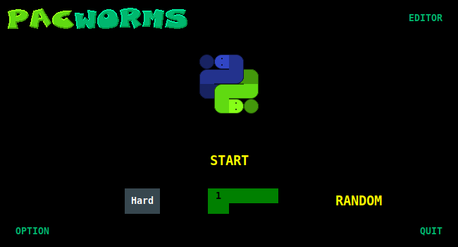
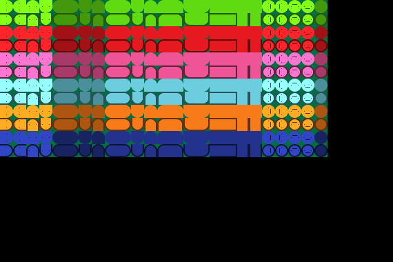
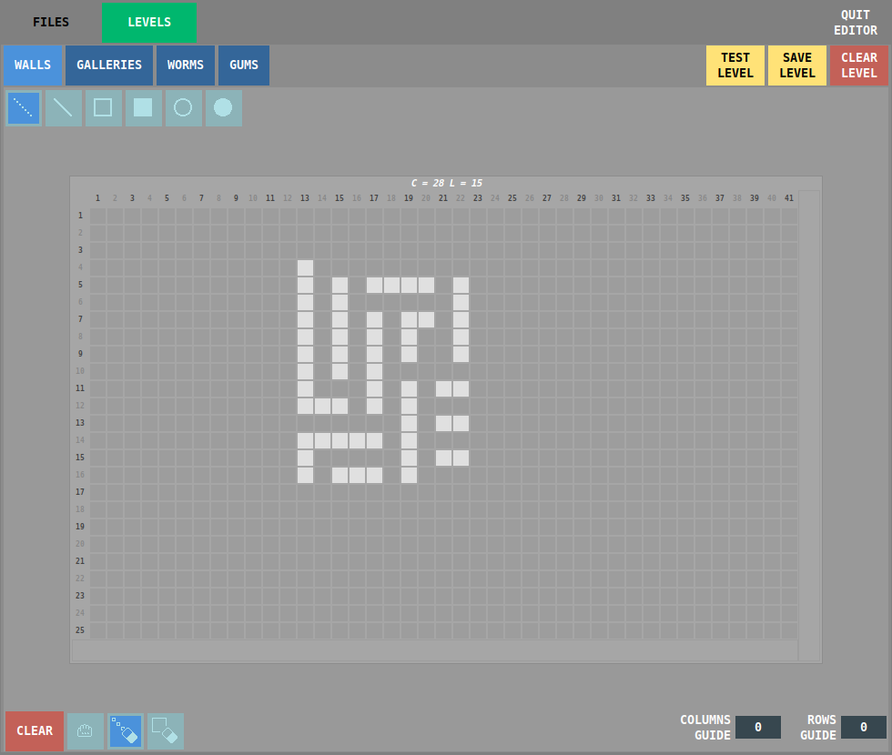

## pacworms

**Description**

`Pacworms` is an arcade game inspired by `Snakles`, a game I coded in C some time ago. For now, the project is on hold. The structure of the game is in place, with windows, graphics, and an editor under construction. The game is coded in `Python`. `Tkinter` is the graphical interface used, and `Pygame` is the game engine.

  

  

  
